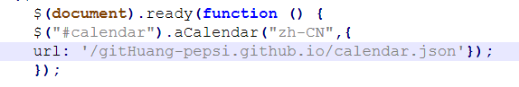

# SVN与Git

- 区别1.本地有无暂存区  2.本地更新是否直接提交
- 即Git为分布式管理，SVN为集中式管理

# Git命令大全
### fetch【查看远端更新情况，不改变本地代码】
- 更新远端追踪分支
- 本地工作分支不变

### pull【fetch+merge】

# 减少冲突的方法
### 1. 每天开始工作前先 pull
   git pull origin main
   拿到最新代码再开始写

### 2. 小步提交
   不要攒很多修改再提交
   频繁小提交减少冲突范围

### 3. 功能分支开发
   每个功能开一个新分支
   不直接在 main 上改代码
   git checkout -b feature/myfeature

### 4. 及时沟通
   和同事说清楚谁在改哪个文件
   避免同时修改同一个文件