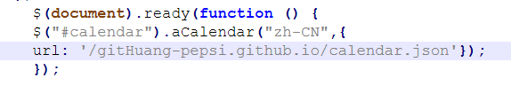

1.在远程仓库重新创建分支hexo，复制原分支，设置为默认分支
2.将原博客目录的源文件拷贝过来，删去其中.git文件，保留忽略文件
3.确保几个插件node、npm、hexo成功安装
4.遇到访问仓库问题，重新生成ssh，在github上添加。
5.本地和远端显示图片不全问题：①取消图片的空格②html与md自带的图片显示均可以，尽量使用md自带③可使用相对路径④有时候用vscode打开没有显示高亮，调整间隔符和换行符转义符等使其正确识别到。
6.pug文件对空格和tab很敏感，需要都用空格缩进，上下对齐，包含内容缩进两个空格
7.部署了两三天的日历插件，却怎么都显示不出来，最后使用命令npm install就显示了
  日历link显示不出来问题：
  在js文件下方加入url即可，日历的json文件成功加载到分支，但是读取出现了问题，就是之前默认的路径有错误，现在手动添加json位置，js能成功读取

小结：
1.Node.js 提供 JavaScript 运行环境。

npm 用来安装 Hexo 及其依赖（如 hexo-cli）。

Hexo 基于 Node.js 开发，通过 npm 安装后，生成静态博客。

2.为何设置ssh？
每次提交代码都需要输入账号和密码，很麻烦，设置ssh密钥之后，在github界面添加，你的机器就会被认为是可信赖的，
这样不需要多次输入密码了。
ssh是针对每台主机的。

3.ssh验证原理
本地生成两个密钥——公钥与私钥，主机与远程仓库通信时，远程生成字符串根据公钥加密发回本地。本地根据私钥解密，再次发送到远程，远程根据解密后的字符串是否与源字符串等同。

4.main分支为默认分支，用于部署博客展示，branch为src分支，存储源文件

5.排查问题步骤：先检查环境，更新依赖等。再查看文件完整性。再看代码中设置问题和默认项问题，是否可找到路径等。